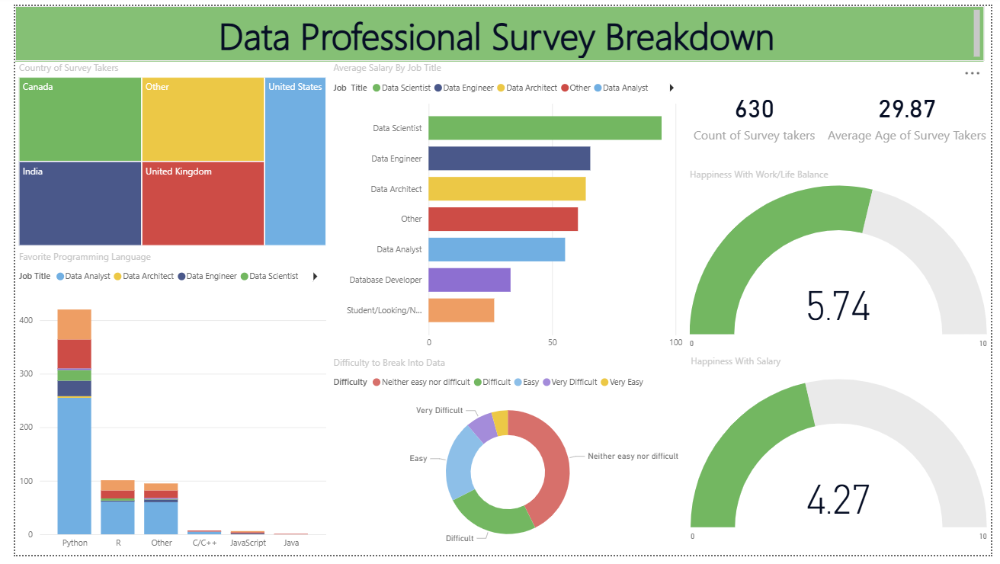

# Data Professional Survey Breakdown (Power BI Project)

## Project Overview
This repository contains a Power BI dashboard that provides an analytical breakdown of survey data collected from data professionals. The dashboard offers insights into demographics, average salaries by job title, preferred programming languages, work-life balance, salary satisfaction, and challenges in entering the data industry.

## Key Insights
- **Demographics:** Majority of survey respondents are from the United States, India, and the United Kingdom.  
- **Average Salary by Job Title:** Data Scientists earn the highest average salary compared to other roles.  
- **Programming Languages:** Python is the most preferred programming language among data professionals.  
- **Industry Entry Difficulty:** Most respondents reported that breaking into data roles is neither easy nor very difficult, though some found it challenging.  
- **Happiness Metrics:**  
  - Work-Life Balance: 5.74 / 10  
  - Salary Satisfaction: 4.27 / 10  

## Dashboard Preview

## Repository Contents
- `Data Professional Survey Breakdown.pbix` – Power BI project file.  
- `dashboard_screenshot.png` – Screenshot of the dashboard.  
- `README.md` – Project documentation.  

## Usage
1. Clone or download this repository.  
2. Open the `.pbix` file using **Power BI Desktop**.  
3. Explore the dashboard for interactive insights.  

## Tools and Technologies
- Power BI Desktop  
- Survey dataset (Data Professionals Survey)  

---

**Author:** Manoj Deepan M  
